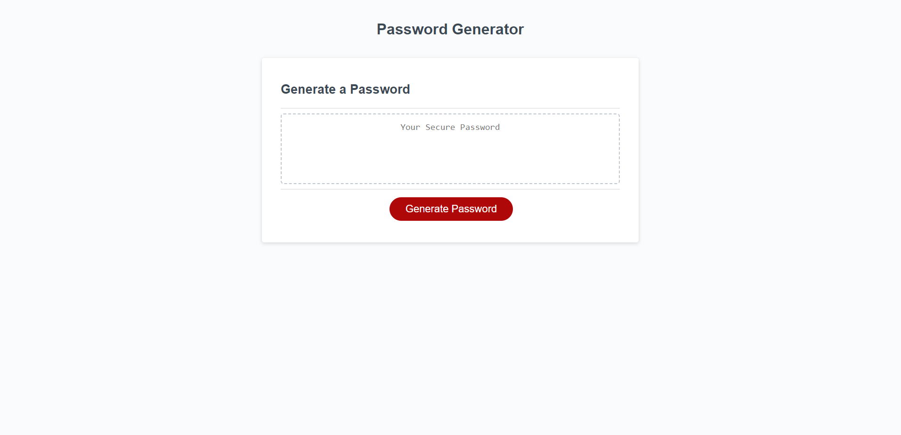

# Password Generator

## Description

This is a simple password generator powered by JavaScript. It takes user input to determine how long the password should be and what type of characters used. With all of the inputs, the app will give you a randomly generated password.
This generator removes the headache of trying to think of a secure passwords and meeting the criteria from websites.
The major problem I had with this project is having to results display in the HTML. With a few tweaks in variable declarations and simplifying functions, I was able to get the app to run multiple times with a new password.

You can try it here: https://cmdnguyen.github.io/GeneratePassword/
## Installation

N/A

## Usage
When you open up the page, it should look like this.

When you click on the "Generate Password" button, it will ask for the password length

If the user puts the value out of the range or gives a blank submission, this alert should come up and ask for the password length again.

Once the user puts in an acceptable password length, the app will ask the user to confirm character types: special characters, numbers, lowercase letters and uppercase letters.

If the users selects cancel on all the options, this alert should come up and ask for the options again.

Once the users inputs the password length and selected the character type, it will generate the password like this.

## Credits

Bootcamp Tutor, Alexis Gonzalez
Stack Overflow: https://stackoverflow.com/questions/75311161/why-is-my-password-generator-not-showing-the-result-in-the-html-box & https://stackoverflow.com/questions/70706563/javascript-password-generator-sometimes-not-including-character-selections

## License

Please refer to LICENSE in the repo.

---
